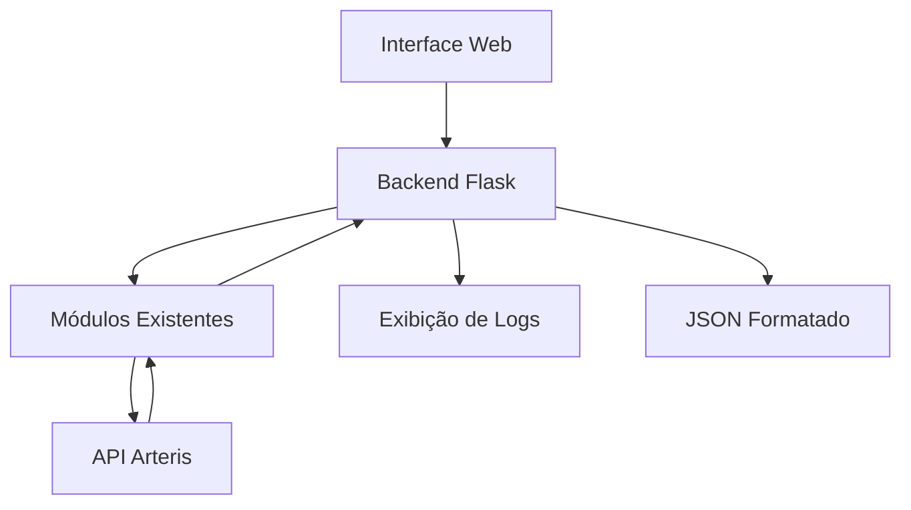

# Plano para Criação da Aplicação Web

Após analisar os arquivos do projeto, vou criar uma aplicação web que utilize os módulos existentes para gerar entidades a partir da API Arteris, exibir logs e permitir o download/cópia do JSON resultante.

## Arquitetura da Solução



## Componentes Principais

1. **Interface Web**:
   - Página HTML com botão "Gerar Entidades"
   - Área para exibição de logs em tempo real
   - Modal ou nova janela para exibir o JSON formatado

2. **Backend Flask**:
   - Rota para iniciar o processo de geração de entidades
   - Captura de logs para exibição na interface
   - Endpoint para fornecer o JSON resultante

3. **Integração com Módulos Existentes**:
   - Utilização dos módulos atuais (api_client, get_docktypes, json_to_entity_transformer)
   - Adaptação para capturar logs e retornar resultados para a interface web

4. **Configuração Docker**:
   - Dockerfile para construção da imagem
   - Docker Compose para facilitar a execução

## Tecnologias a serem utilizadas

- **Backend**: Flask (Python)
- **Frontend**: HTML, CSS, JavaScript (com Bootstrap para estilização)
- **Comunicação**: WebSockets para logs em tempo real
- **Containerização**: Docker e Docker Compose

## Detalhamento da Implementação

### 1. Estrutura de Arquivos

```
arteris_entidades/
├── api_client.py (existente)
├── api_client_data.py (existente)
├── get_docktypes.py (existente)
├── json_to_entity_transformer.py (existente)
├── main.py (existente)
├── app.py (novo - aplicação Flask)
├── log_capture.py (novo - captura de logs)
├── static/ (novo)
│   ├── css/
│   │   └── style.css
│   └── js/
│       └── main.js
├── templates/ (novo)
│   ├── index.html
│   └── json_view.html
├── Dockerfile (novo)
├── docker-compose.yml (novo)
└── requirements.txt (atualizado)
```

### 2. Modificações no Backend

1. **Criar app.py**:
   - Implementar servidor Flask
   - Configurar Socket.IO para comunicação em tempo real
   - Criar rotas para iniciar o processo e obter resultados
   - Adaptar o código existente para capturar logs

2. **Criar log_capture.py**:
   - Implementar um manipulador de logs personalizado
   - Redirecionar saídas de print para o Socket.IO

3. **Atualizar requirements.txt**:
   - Adicionar Flask, Flask-SocketIO e outras dependências necessárias

### 3. Implementação do Frontend

1. **Página Principal (index.html)**:
   - Interface com botão "Gerar Entidades"
   - Área para exibição de logs em tempo real
   - Indicador de progresso

2. **Visualizador de JSON (json_view.html)**:
   - Exibição formatada do JSON
   - Botões para copiar e baixar
   - Sintaxe highlighting para melhor visualização

3. **JavaScript (main.js)**:
   - Conexão com Socket.IO para receber logs em tempo real
   - Funções para exibir logs na interface
   - Funções para abrir nova janela com JSON formatado

### 4. Configuração Docker

1. **Dockerfile**:
```dockerfile
FROM python:3.9-slim

WORKDIR /app

COPY requirements.txt .
RUN pip install --no-cache-dir -r requirements.txt

COPY . .

EXPOSE 5000

CMD ["python", "app.py"]
```

2. **docker-compose.yml**:
```yaml
version: '3'
services:
  web:
    build: .
    ports:
      - "5000:5000"
    volumes:
      - .:/app
    environment:
      - FLASK_ENV=production
```

## Fluxo de Execução

1. Usuário acessa a aplicação web
2. Clica no botão "Gerar Entidades"
3. Backend inicia o processo de geração
4. Logs são exibidos em tempo real na interface via WebSockets
5. Ao finalizar, o JSON é disponibilizado para visualização/download
6. Usuário pode copiar ou salvar o JSON

## Considerações Adicionais

- **Segurança**: Implementar proteção para as credenciais da API
- **Tratamento de Erros**: Exibir mensagens amigáveis em caso de falhas
- **Responsividade**: Garantir que a interface funcione bem em diferentes dispositivos
- **Performance**: Otimizar para lidar com grandes volumes de dados

## Próximos Passos

1. Implementar a estrutura básica do Flask
2. Criar o sistema de captura de logs
3. Desenvolver a interface web
4. Integrar com os módulos existentes
5. Configurar Docker
6. Testar a aplicação