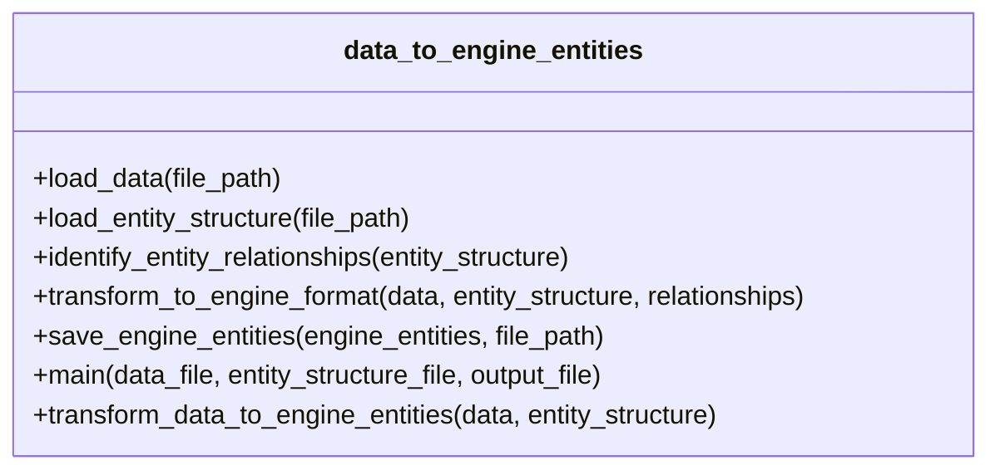
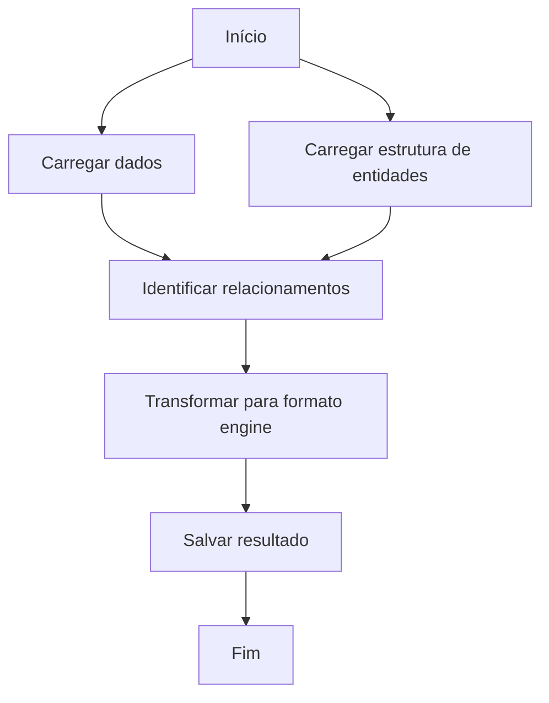

# Plano de Implementação: data_to_engine_entities

## Visão Geral

Este documento descreve o plano de implementação para o novo módulo `data_to_engine_entities.py`, que será responsável por transformar os dados obtidos da API Arteris em uma estrutura de entidades compatível com o formato do arquivo `engine_entities.js`.

## Contexto

O projeto atual busca dados da API Arteris e os transforma em estruturas de entidades. O novo módulo irá:

1. Receber os dados de `get_data_from_key` (exemplo em `output_data.json`)
2. Receber a lista de entidades de `transform_entity_structure` (exemplo em `output_entity_structure_from_metadata.json`)
3. Criar uma nova lista de entidades no formato do arquivo `engine_entities.js`
4. Seguir regras específicas:
   - Id = name (Chave)
   - Para entidades do tipo Child, o primeiro atributo é o valor de parent (chave do registro pai)

## Estrutura do Módulo

O módulo será implementado no arquivo `data_to_engine_entities.py` com as seguintes funções:



## Detalhamento das Funções

### 1. load_data(file_path)
- **Descrição**: Carrega os dados de `output_data.json`
- **Parâmetros**:
  - `file_path`: Caminho para o arquivo de dados
- **Retorno**: Lista de objetos com doctype, key e data
- **Tratamento de Erros**: Verifica se o arquivo existe e se o conteúdo é um JSON válido

### 2. load_entity_structure(file_path)
- **Descrição**: Carrega a estrutura de entidades de `output_entity_structure_from_metadata.json`
- **Parâmetros**:
  - `file_path`: Caminho para o arquivo de estrutura de entidades
- **Retorno**: Objeto com a lista de entidades
- **Tratamento de Erros**: Verifica se o arquivo existe e se o conteúdo é um JSON válido

### 3. identify_entity_relationships(entity_structure)
- **Descrição**: Analisa o campo "relationships" de cada entidade na estrutura para identificar entidades Child
- **Parâmetros**:
  - `entity_structure`: Estrutura de entidades carregada
- **Retorno**: Dicionário com:
  - Mapeamento de tipos de entidade para "Parent" ou "Child"
  - Mapeamento de entidades Child para suas entidades Parent
- **Lógica**:
  - Uma entidade é considerada Child se tiver um relacionamento onde o "sourceKey" é "parent"
  - A entidade referenciada por esse relacionamento é considerada Parent

### 4. transform_to_engine_format(data, entity_structure, relationships)
- **Descrição**: Transforma os dados e a estrutura de entidades no formato do `engine_entities.js`
- **Parâmetros**:
  - `data`: Dados carregados
  - `entity_structure`: Estrutura de entidades carregada
  - `relationships`: Mapeamento de relacionamentos
- **Retorno**: Objeto no formato `{"entities": [...]}`
- **Lógica**:
  - Para cada item em `data`:
    - Cria uma entidade no formato de `engine_entities.js`
    - Define o "id" como o valor do campo "name" (chave)
    - Define o "entity_type" com base no mapeamento de relacionamentos
    - Para entidades do tipo "Child", garante que o primeiro atributo seja o valor de "parent"
    - Mapeia os demais atributos conforme necessário

### 5. save_engine_entities(engine_entities, file_path)
- **Descrição**: Salva o resultado no formato JSON em um arquivo
- **Parâmetros**:
  - `engine_entities`: Objeto de entidades transformado
  - `file_path`: Caminho para o arquivo de saída
- **Retorno**: None
- **Tratamento de Erros**: Verifica se o diretório existe e se tem permissão para escrever

### 6. transform_data_to_engine_entities(data, entity_structure)
- **Descrição**: Função de alto nível que combina as funções acima
- **Parâmetros**:
  - `data`: Dados a serem transformados
  - `entity_structure`: Estrutura de entidades
- **Retorno**: Objeto de entidades transformado
- **Uso**: Pode ser chamada diretamente pelo `main.py`

### 7. main(data_file=None, entity_structure_file=None, output_file=None)
- **Descrição**: Função principal que orquestra o processo
- **Parâmetros**:
  - `data_file`: Caminho para o arquivo de dados (padrão: "output_data.json")
  - `entity_structure_file`: Caminho para o arquivo de estrutura de entidades (padrão: "output_entity_structure_from_metadata.json")
  - `output_file`: Caminho para o arquivo de saída (padrão: "engine_entities_output.json")
- **Retorno**: None
- **Uso**: Permite que o módulo seja executado independentemente

## Fluxo de Execução



## Integração com o Sistema Existente

O módulo será implementado de forma a poder ser usado de duas maneiras:

1. **Como módulo independente**:
```bash
python data_to_engine_entities.py
```

2. **Importado pelo `main.py`**:
```python
# Importar o novo módulo
from data_to_engine_entities import transform_data_to_engine_entities

# No final da função main()
# Transformar dados para o formato engine_entities
engine_entities = transform_data_to_engine_entities(all_doctype_data, entity_structure)

# Salvar o resultado
output_engine_filename = "engine_entities_output.json"
try:
    with open(output_engine_filename, "w", encoding="utf-8") as f:
        json.dump(engine_entities, f, indent=4, ensure_ascii=False)
    print(f"\nEntidades no formato engine salvas em {output_engine_filename}")
except IOError as e:
    print(f"\nErro ao salvar o arquivo {output_engine_filename}: {e}")
```

## Considerações Adicionais

### Tratamento de Erros
- Validação de entrada para garantir que os dados e a estrutura de entidades estão no formato esperado
- Tratamento de exceções para lidar com erros durante o processamento

### Logging
- Adicionar logs para facilitar a depuração e o monitoramento

### Testes
- Criar testes unitários para validar o funcionamento do módulo

### Documentação
- Adicionar docstrings detalhadas para todas as funções
- Incluir exemplos de uso

## Próximos Passos

1. Implementar o módulo conforme o plano
2. Testar o módulo com os dados de exemplo
3. Integrar o módulo ao sistema existente
4. Documentar o uso do módulo